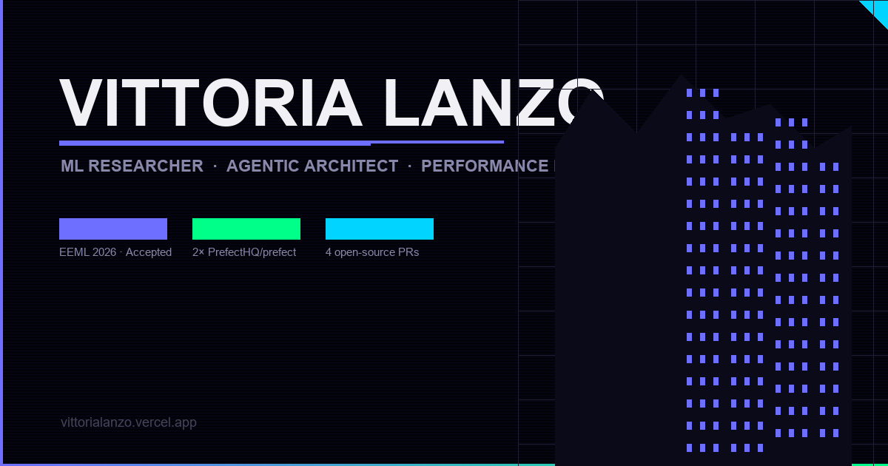

# NeonWalk

**An interactive 3D cyberpunk street you scroll-walk through — rendered in real time in the browser.**

[](https://vittorialanzo.vercel.app)
[](https://github.com/VittoriaLanzo/NeonWalk/actions/workflows/ci.yml)


<p align="center">
  <a href="https://vittorialanzo.vercel.app">
    
  </a>
</p>

NeonWalk is my portfolio rebuilt as a place instead of a page. You don't scroll a document — you move a camera down a procedurally-built neon street, past kiosks that open each section (Research, Projects, Experience, About). One scroll value drives the entire experience.

It is also a rendering exercise. A full city at 60fps in a browser tab — on a phone — only works if you treat every frame as a budget. The notes below are the engineering, not the aesthetic.

---

## Engineered for 60fps

The scene is large (≈60 procedural buildings, animated drones, rain, steam, hundreds of windows). Keeping it smooth is deliberate, not incidental:

- **3-tier distance LOD.** Every building swaps between *full* / *mid* / *far* geometry based on its distance to the camera. Far buildings collapse to a single emissive box; only what's near you pays for fire escapes, balconies, recessed windows and per-trim lights. LOD checks are frame-throttled and use squared distance (no per-frame `sqrt`).
- **Procedural, zero-download textures.** Brick facades, road, and sidewalk are painted to an offscreen `<canvas>` at runtime and memoized — no texture assets to fetch, decode, or ship in the bundle.
- **GPU instancing** for everything repeated: road markings, floating dust, and steam-vent particles render as single `InstancedMesh` draw calls instead of hundreds of objects.
- **Capped device pixel ratio** (`dpr={[1, 1]}`), `antialias: false`, ACES tone mapping, and `powerPreference: 'high-performance'` — the renderer is configured for throughput, not maximum fidelity.
- **Fog-based depth culling.** `FogExp2` doubles as atmosphere *and* a soft far-clip so distant geometry never costs full shading.
- **Mobile degradation path.** On small screens the scene drops steam, overhead cables, and background silhouettes, and cuts particle and star counts — same world, lighter budget.
- **Code-split bundle.** Vite `manualChunks` separates `three`, `@react-three/fiber`/`drei`, and the React vendor chunk so the heavy 3D payload caches independently of app code. `CityScene` is lazy-loaded behind a loading screen for faster first paint.

---

## Architecture

The whole experience is driven by a single master variable: **`scrollProgress`** (0 → 1), derived from a tall scroll container.

```
scrollProgress ──┬──> CameraController   (lerps the camera on a z-axis flythrough)
                 ├──> Glass panels       (which section teaser is visible)
                 ├──> Hero overlay        (fade in/out)
                 └──> Contact billboard   (revealed at the end of the street)
```

- **`src/components/CityScene.tsx`** — the `@react-three/fiber` canvas and every world component (buildings, kiosks, drones, lights, atmosphere).
- **`src/pages/Index.tsx`** — the scroll driver and the 2D overlay layer.
- **`src/content/sections.ts`** — **single source of truth for all content.** Research papers, OSS contributions, experience and about copy live here as typed data; both the in-world teasers and the full section pages read from it.
- **`src/pages/sections/`** — full scrollable pages (Research / Projects / Experience / About) sharing one shell.

CI (`.github/workflows/ci.yml`) runs `tsc --noEmit`, ESLint at zero warnings, a production build, and unit tests on every push and PR.

---

## Tech stack

| Layer | Tools |
|---|---|
| **3D / render** | Three.js · @react-three/fiber · @react-three/drei |
| **Animation** | GSAP · custom scroll-driven camera |
| **App** | React 18 · TypeScript (strict) · React Router · TanStack Query |
| **UI** | Tailwind CSS · shadcn/ui (contact form + toasts) |
| **Build / test** | Vite · Vitest · ESLint · GitHub Actions |

---

## Run it locally

```bash
npm install
npm run dev        # dev server on http://localhost:8080
```

```bash
npm run build      # production bundle → dist/
npm run lint       # ESLint (zero errors enforced in CI)
npx tsc --noEmit   # type-check
npm test           # vitest
```

---

## About

Built by **Vittoria Lanzo** — ML researcher and open-source performance engineer (Cesena, Italy). EEML 2026 (accepted); merged performance PRs into [PrefectHQ/prefect](https://github.com/PrefectHQ/prefect/pulls?q=author%3AVittoriaLanzo); Silver Medal, MEGA Hackathon 2026.

Full profile → [github.com/VittoriaLanzo](https://github.com/VittoriaLanzo) · Live portfolio → [vittorialanzo.vercel.app](https://vittorialanzo.vercel.app)
